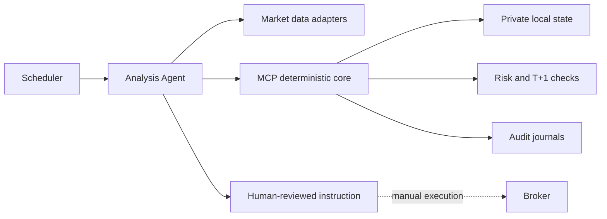

# A-Share Trading Agent Harness

一个面向沪深主板分析场景的领域型 Agent Harness：用 Prompt 协议和 MCP 工具编排 Agent，用确定性程序承接状态、风险、调度与审计，仅生成供人工确认的交易辅助建议。

> 本项目不连接券商，不自动下单，不承诺收益，也不构成投资建议。公开仓库不包含任何真实账户、持仓、现金、候选池、交易记录或任务标识。

## 为什么是 Agent Harness

- **Orchestration**：Scheduler、原子 Dispatcher 和每日唯一分析任务组成可恢复的多节点运行框架。
- **Tool contract**：MCP stdio server 为账户、候选池、策略检查、订单意图、成交反馈和归档提供结构化接口。
- **Deterministic state**：资金、股份、T+1、未反馈委托锁定和策略版本由程序维护，不从对话历史推断。
- **Guardrails**：Agent 的建议必须经过风险规则和状态校验；关键证据不足时拒绝生成新买入或伪精确指令。
- **Resilience**：节点之间相互独立，重复、过期和未来节点静默跳过；外部数据适配器可替换，单源失败不阻断归档。
- **Observability**：每次运行保存证据、数据健康、策略检查和用户可见结论，并形成日报、周报与月报。
- **Human-in-the-loop**：Agent 只创建订单意图，账户仅在用户反馈实际结果后更新。

## 核心边界

- **Agent 层**：按 Prompt 选择行情、K线、板块、公告和新闻来源，负责重试、降级、解释与建议。
- **确定性核心**：维护账户、T+1、未反馈委托锁定、候选池、风险纪律、节点认领和审计归档。
- **外部适配器**：行情与新闻工具不与核心耦合；单源失败不能阻断其他类别和归档。
- **人工执行**：建议必须给出明确限价、股数、时段与失效条件，但不会提交到券商。



## Harness 能力

- 每个交易日复用唯一分析任务，多个时间节点独立触发。
- 原子节点认领：错过早盘节点不影响后续节点，历史节点不会补发过期指令。
- 每周候选池漏斗：板块硬筛、每板块最多10只、固定评分、最多5只候选。
- 固定止损、分级止盈、移动止盈、仓位风险预算和双向做T检查。
- 精确订单意图与成交反馈状态机，未反馈时锁定资金或可卖股份。
- 日报、周报、月报和策略演进门禁。
- 无外部运行依赖的 MCP stdio server。

## 快速开始

```powershell
python -m venv .venv
.\.venv\Scripts\Activate.ps1
pip install -e ".[dev]"

$env:A_SHARE_DESK_HOME = "$PWD\.runtime"
a-share-desk init --date 2026-01-05 --available-cash 100000 --positions examples/empty_positions.json
a-share-desk account
pytest -q
```

Linux/macOS 使用 `export A_SHARE_DESK_HOME="$PWD/.runtime"`。`A_SHARE_DESK_HOME` 下生成的 `state/`、`records/` 和 `journal/` 都是私有运行数据。

## MCP

启动 stdio server：

```bash
python -m trading_desk.mcp_server
```

客户端配置参考 [examples/mcp-config.example.json](examples/mcp-config.example.json)。工具包括账户读取、跨日滚动、节点认领、候选池维护、策略检查、订单意图、成交反馈和归档。

## Prompt 工作流

- [全局协议](prompts/global_policy.md)
- [Agent 数据采集协议](prompts/data_acquisition.md)
- [日内节点](prompts/daily_nodes.md)
- [调度与每日唯一任务](prompts/daily_dispatcher.md)
- [每周候选池筛选](prompts/weekly_candidate_screen.md)

外部行情技能或 API 不随本仓库提供。接入时应遵守数据采集协议：分类取数、当前节点重新采集、腾讯主源成功即停止、失败时限时降级，以及单一合规来源即可进入精确指令流程。

## 文档

- [Agent Harness 定位](docs/AGENT_HARNESS.md)
- [架构说明](docs/ARCHITECTURE.md)
- [自动任务设计](docs/AUTOMATIONS.md)
- [隐私与安全](SECURITY.md)

## 隐私

真实运行目录已被 `.gitignore` 排除。不要把券商截图、账户JSON、任务ID、自动化ID、Cookie、Token或交易日志提交到公开仓库。示例文件全部为空状态或占位符。
