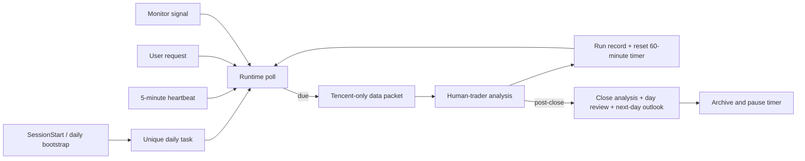

# A-Share Dynamic Trading Agent Harness

一个面向沪深主板、仅分析不自动下单的本地 Agent Harness。Agent 负责解释市场并提出供人工确认的建议；确定性程序负责账户、T+1、资金与股份锁定、腾讯行情新鲜度、动态计时器、监控防抖和审计归档。

> 本项目不连接券商，不承诺收益，也不构成投资建议。公开仓库不包含真实账户、持仓、现金、候选池、交易记录、Codex 任务 ID 或自动化 ID。

## v5.1 工作流

- 每个北京时间交易日只保留一个 `A股交易台 YYYY-MM-DD` 任务。
- 首次进入项目后立即分析；后续完整分析由上次完成 60 分钟、用户请求、监控信号或收盘触发。
- 5 分钟 heartbeat 只轮询触发条件，不等于每 5 分钟执行完整分析。任何手动分析完成后都会重置 60 分钟计时。
- 不再暴露或使用八个固定时间节点。
- 收盘必须先生成新的 `market_close` 数据包并执行完整分析，再复核全天记录，最后生成下一交易日的基准/偏强/偏弱预期和条件行动计划。三部分缺一不可。



## 数据可信边界

- 盘中个股、指数、分时、日 K 和板块成分股报价只使用腾讯。
- 腾讯缺失、超时、字段异常或时间戳过期时标记 `tradeable=false`；缓存只能作为背景，不得生成精确交易建议。
- 不自动切换东方财富、同花顺或 DangInvest。它们只可在周筛或人工诊断中作为候选来源。
- 板块不依赖第三方盘中板块接口。周筛来源必须同日、完整度至少 95%、连续成功至少 2 次，才保存成分股快照；盘中以快照代码和腾讯批量行情本地计算板块代理。

StockPet 仅作为腾讯批量请求、退避、陈旧标记和阈值防抖的工程参考，本项目没有继承其数据源回退策略。

## 输出和安全

每轮按“事实 → 解读 → 规则 → 结论”展示逻辑。真实可执行建议先通过 `order_intent_create` 锁定资源，并严格输出：

```text
时间，股票，买/卖精确价格，买卖数量，反馈等待时间
10:35-10:40，600000 示例股票，买 10.230 元，100 股，等待反馈至 10:45
```

次日计划是条件预案，不是隔夜委托。信号出现后必须重新分析，才能登记真实订单意图。

## 快速开始

```powershell
python -m venv .venv
.\.venv\Scripts\Activate.ps1
pip install -e ".[dev]"

$env:A_SHARE_DESK_HOME = "$PWD\.runtime"
a-share-desk init --date 2026-01-05 --available-cash 100000 --positions examples/empty_positions.json
a-share-desk account
pytest -q
```

Linux/macOS 使用 `export A_SHARE_DESK_HOME="$PWD/.runtime"`。运行时生成的 `state/`、`records/`、`journal/` 和策略复盘会保存在私有目录中。

MCP 服务：

```bash
python -m trading_desk.mcp_server
```

客户端示例见 [examples/mcp-config.example.json](examples/mcp-config.example.json)。动态协议位于 `prompts/`，运行配置位于 `config/runtime.json`，监控模板位于 `monitoring/templates.json`。

## 关键组件

- `trading_desk/runtime.py`：唯一日任务、租约、60 分钟计时、监控/收盘触发、关闭与复盘修订。
- `trading_desk/market_packet.py`：腾讯批量报价、分时、日 K、本地指标、大盘和板块代理。
- `trading_desk/monitoring.py`：监控计划、crossing、cooldown、rearm 和信号留档。
- `trading_desk/reports.py`：三段式收盘校验、次日条件预案、日报/周报/月报与交接包。
- `trading_desk/state.py`：账户、T+1、候选池、板块快照、订单意图和运行审计。

更多说明见 [架构](docs/ARCHITECTURE.md)、[自动任务](docs/AUTOMATIONS.md)、[数据矩阵](docs/TRADER_DATA_MATRIX.md) 和 [安全策略](SECURITY.md)。
